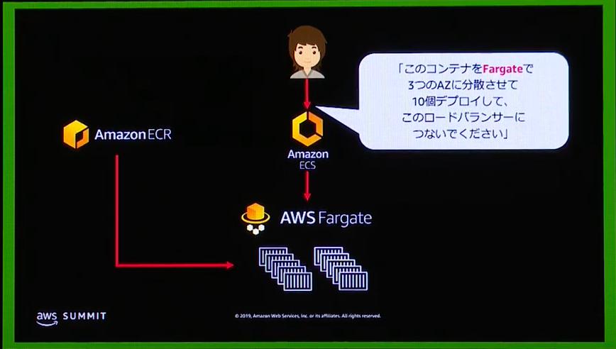
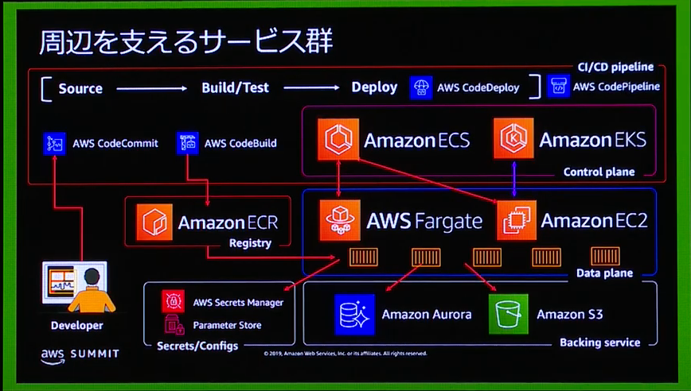
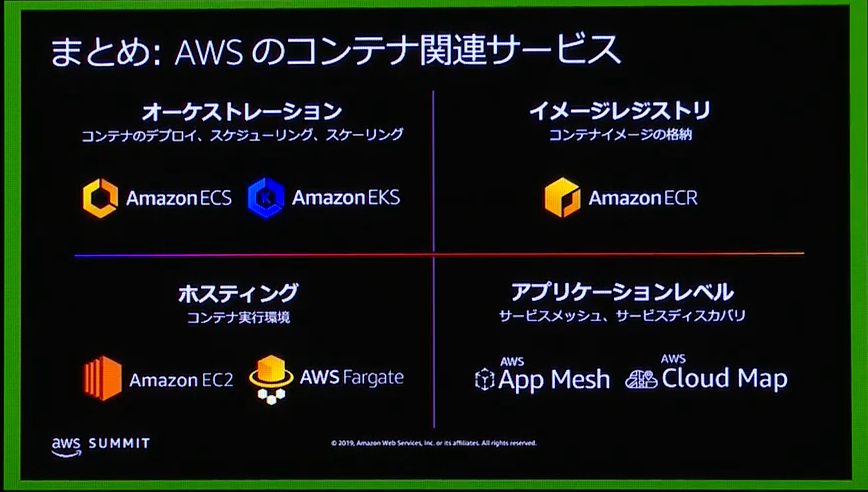

# 【初級】AWS コンテナサービス入門 | AWS Summit Tokyo 2019

[YouTube](https://www.youtube.com/watch?v=L4bLDNRSYC8)  
[スライド](https://pages.awscloud.com/rs/112-TZM-766/images/C3-01.pdf)  

## コンテナとは

アプリケーションが依存する要素として以下のものがある。

- ランタイム/エンジン
- アプリケーションコード
- 依存ライブラリ/パッケージ
- 環境依存情報

アプリケーションが依存するもの全てをコンテナにひとまとめにしたい。  
但し環境依存情報だけはコンテナに入れず後から入れる。  

### 仮想マシンとコンテナ

仮想マシンとコンテナはよく似ている  
コンテナの事を軽量な仮想マシンだと思ってしまう **違う**

仮想マシンは「マシン」、
コンテナは「プロセス」

プロセスであるから、NginxとTomcatとを一緒に入れるような形はアンチパターン。  
（また別の機会で）  

### Dockerを利用した基本的ワークフロー

1. Dockerfileを書く/コンテナ内で作業してコンテナイメージを作る
2. コンテナイメージをイメージレジストリにpushする
3. デプロイしたい環境に入ってイメージレジストリからコンテナイメージをpullする
4. 環境内でdocker run ...する

Dockerだけでは自動化はされない  
Dockerの責務は同一サーバ上のコンテナライフライクル管理  
複数サーバやコンテナを束ねた概念に対するオペレーションはスコープ外  
-> コンテナオーケストレーションが必要  

## コンテナオーケストレーション

手作業でのコンテナ操作はミスオペが起こる  
オーケストレーションツールのAPIにだけアクセスすることで、オペレーターは各環境にアクセスせずにコンテナの操作ができる  

「このEC2インスタンスのクラスタでコンテナを実行したい」
「このコンテナを3つのAZに分散させて10個デプロイして、このロードバランサーに繋いでください」

ECSはコンテナオーケストレーションツールのひとつ。  

### ECSの特徴

- クラウドでコンテナを本番環境利用するためのオーケストレーター
- 各種AWSサービスとの高度な連携
- 高スケーラビリティ
- シンプル：学ぶべきリソース表現は2つ
  - タスク
  - サービス
- Linux/Windowsサポート

### EKSの特徴

- 運用難易度の高いKubernetesマスターをマネージドで提供
  - Kubernetes自体は何も手を加えていない
- エコシステムのOSSやツールを利用できる
- 各種AWSサービスとの連携
- EKSサービスチーム、OSSチームによるKubernetesコミュニティへの貢献
- オープンソース
- 高い表現力
  - Pod, Deployment, Service, Jobなどのリソース表現
  - 勉強は必要

51％のkubernetesユーザーがAWS上で動かしている  
-> AWSで動かしたいという需要に応じて作られた

## コンテナイメージレジストリ

### ECR

- フルマネージドなプライベートコンテナイメージレジストリ
- セキュア
- スケーラブルかつ高い可用性
- Docker CLIからの利用
- ECS,EKS以外のコンテナオーケストレーターからも利用可能

## 実行環境EC2インスタンスの運用業務

デプロイは自動化できたが、運用はまだ残っている  

- OSやエージェント類へのパッチ当て・更新
- 実行中のコンテナ数に基づくEC2インスタンス数のスケーリング
- など

### Faragate

- AWSマネージド
  - EC2インスタンスのプロビジョン、スケール、管理不要
- コンテナネイティブ
  - 仮想マシンを意識しないでいい
- AWSサービスとの連携

**仮想マシン（EC2）は見えなくなる！**

## 現実世界のコンテナワークロード

### 周辺サービスも当然検討する必要がある

コンテナサービスだけ使ってもシステムは当然作れない。

### コンピューティングの選択肢としてコンテナが本当に適切か？

運用コストが最も低く、コントロール範囲が最も狭いのがFunctions（Lambda）  
その逆が仮想マシン（EC2）  
間にいるのがコンテナ（ECS,EKS）  

適切なコンピューティングの選択が必要である

## まとめ

