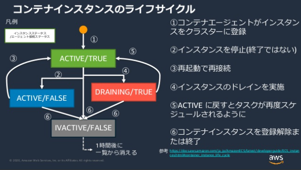
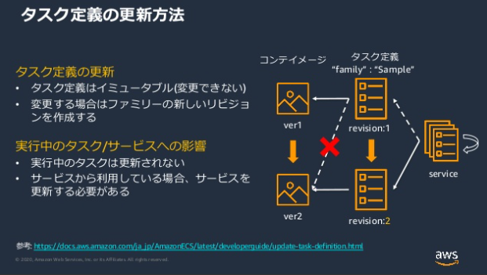
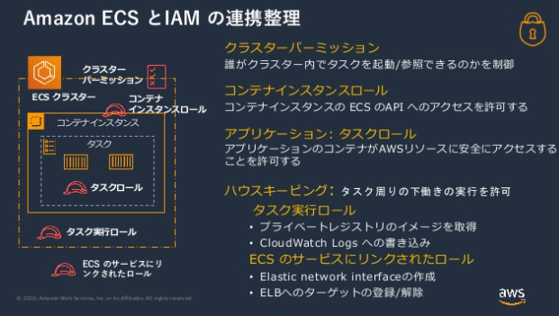

# 20190717 AWS Black Belt Online Seminar Amazon Elastic Container Service (Amazon ECS)

[YouTube](https://www.youtube.com/watch?v=tmMLLjQrrRA)  
[スライド](https://www.slideshare.net/AmazonWebServicesJapan/20200422-aws-black-belt-online-seminar-amazon-elastic-container-service-amazon-ecs?ref=https://aws.amazon.com/)  
[FAQ](https://aws.amazon.com/jp/blogs/news/webinar-bb-amazon-ecs-2020/)
[事前知識](https://pages.awscloud.com/rs/112-TZM-766/images/C3-01.pdf)

## AWSコンテナサービス概要

[参考](./210307_AWSコンテナサービス入門.md)

ECSはクラウドでコンテナを本番利用するオーケストレーターである

## ECSの基本

ECSには主要要素が4つある

- タスク定義
  - コンテナを利用する設計書
    - コンテナ定義
    - 要求CPUやメモリ
    - タスクに割り当てるIAMロールなど...
- クラスター
  - 実行環境の境界
  - スケジュールされたタスクの実行を設定可能
- タスク
  - タスク定義に基づき起動されるコンテナ郡
- サービス
  - タスク実行コピー数（n個）
  - 起動タイプ（EC2, Fargate）を設定

## ECS機能紹介

### コンテナの実行環境：EC2起動タイプ

- ECSコンテナインスタンス
  - ECS-optimized AMI（ECSに最適化されたAMI）を元に作られる
    - コンテナインスタンスに求められる要件/推奨事項に従って事前構築されている
      - DockerデーモンやECSコンテナエージェントなど
    - 使わない事もできるが初めて使う場合はこちらを推奨
  - ECSコンテナエージェントを実行しクラスターに登録されているEC2インスタンス
    - コンテナインスタンスの管理やタスクの実行/停止を行う
    - このエージェント自体もコンテナで実行される

- コンテナインスタンスのドレイン
  - クラスターからコンテナインスタンスを削除したい場合
    - システム更新など
  - 順序  
    1.コンテナインスタンスをDRAININGに設定  
    2.PENDING状態のサービスタスクは即時停止  
    3.RUNNING状態のサービスタスクはサービスのデプロイ設定に従って代替されていく

### コンテナの実行環境：Fargate

- EC2の運用を排して、コンテナにだけ集中したい要望に応えた
  - Faragateについて詳しく知るには -> [FargateのBlackBelt](https://www.youtube.com/watch?v=rwwOoFBq2AU)

### タスク定義

- アプリケーションを構成するコンテナを定義するJSON形式のテキストファイル

#### 必須パラメータ：family

- family
  - タスク定義の名前
  - ファミリーとリビジョン番号で1つのタスク定義が特定される
  - タスク定義はイミュータブルのため、同じファミリーの新しいリビジョン番号のタスク定義を作成しなおす

参考  

#### 必須パラメータ：containerDefinitions

- タスク実行時コンテナランタイムに渡されるコンテナ定義
- コンテナのイメージやポートマッピング、メモリ制限など
- 中のパラメータ
  - name : コンテナの名前
  - image : 使用するコンテナのイメージ
  - memory : コンテナに適用されるメモリのハードリミット
  - memoryReservation : コンテナ用に予約されるメモリのソフト制限
  - logConfiguration : コンテナのログ設定
    - AWSログドライバを利用すればSTDOUT/STDERRをCloudWatchに渡せる
  - enviroment : コンテナ環境変数、平文なので機密情報は扱うべきではない
  - secrets : 機密データを環境変数に指定するためのもの
    - AWS Secrets Managerシークレット、Systems Managerパラメータストアのパラメータを参照可能
  - dependsOn : コンテナ間の起動順、停止順を明示的に設定する
    - condition : 起動開始を検知してから起動開始する、終了を検知してから起動開始するなどの設定が可能

#### コンテナ環境情報として機密情報を取り扱うには

- AWS Secrets Managerシークレット
  - EC2起動タイプではJSONキーやバージョンを指定可能
  - Fargate起動タイプはJSONドキュメントをそのまま取得し、アプリケーション側でparse
- AWS Systems Managerパラメータストア
  - 同じリージョンの場合は名前のみでも可能
  - 別リージョンであれば完全なARNが必要

#### オプションの中で重要なパラメータ

- タスクロール
  - コンテナが利用できるIAMロール
  - アプリケーションがAWSサービスのAPIを実行する時
- タスク実行ロール
  - ECSコンテナエージェントが利用するIAMロール
  - コンテナのイメージをpullしたりCloudWatch Logsに書き込んだり
- ネットワークモード
  - none : 外部と接続しない
  - bridge : Dockerの組み込み仮想ネットワークを使用して外部ネットワークと通信、EC2起動タイプのデフォルト
  - host : Dockerの組み込み仮想ネットワークをバイパスし、コンテナポートがホストEC2インスタンスのNICに直接マッピング
  - awsvpc : Fargate起動タイプの前提
    - タスクごとにENIを自動割当できる
      - EC2インスタンス毎にENIの上限が決まっているので、上限に達した時追加のタスクが配置できないことがある
      - ENIトランキング：ENI密度の高いコンテナインスタンスを利用できる
    - タスク内のコンテナはlocalhostインターフェースを共有
    - VPC内の他のリソースへPrivate IPで通信が可能
    - FargateではPublic IPの割当も可能
- ボリューム
  - データを共有、永続化するためのボリュームのリスト
  - Dockerボリューム
    - EC2起動タイプのみ
    - タスク間で共有できる
    - 明示的なライフサイクル
      - scope = taskの場合はタスクのterminateと共に削除される
      - scope = sharedの場合はタスク間で共有できる
  - バインドマウント
    - ホストマシンのファイル/ディレクトリをコンテナにマウント
    - Faragetではコンテナ間の情報共有に使われる
    - ホストマシンのディレクトリをマウントした場合、タスク停止後もインスタンスに残る
      - コンテナインスタンスの中に残ったファイルのライフサイクルは自分で管轄する必要がある
  - EFSボリューム
    - 配置されているコンテナインスタンスに関わらず、同じ永続的ストレージにアクセス可能
- タスクサイズ
  - タスクに適用するCPUとメモリのハード制限
  - Fargate起動タイプでは必須

こちらも参考
Amazo ECS DeepDive AWS BlackBelt
[資料](https://d1.awsstatic.com/webinars/jp/pdf/services/20190731_AWS-BlackBelt_AmazonECS_DeepDive_Rev.pdf)
[動画](https://www.youtube.com/watch?v=3bohQetK2OE)

#### ECSとIAM

### コンテナの実行

タスク定義からコンテナを実行する方法は2つある

- タスク
  - タスク定義に従って実行されるアプリケーションの実行単位
  - バッチジョブなど処理が終わると停止するワークロードなど

- サービス
  - 指定した数のタスクを維持する
  - タスクが失敗/停止した場合は新しいタスクを起動して置き換える
  - Webアプリケーションなど長時間実行するアプリケーションで利用
  - ELBとの連携、AutoScaling

#### タスクの配置

- タスク配置の制約事項
  - タスク配置痛に考慮されるルール
  - AZやインスタンスタイプに基づいて制約をかけられる
- タスクの配置戦略
  - タスク配置/終了時にインスタンスを選択するアルゴリズム

EC2起動タイプでのみ

#### サービススケジューラ戦略

サービスがタスクをスケジューリングする際の戦略

- レプリカ
  - クラスタ全体で必要数のタスクを維持
  - 通常のアプリケーションではこちらを利用する
- デーモン
  - インスタンスごとに1つのタスクをデプロイ
  - 各コンテナインスタンスで実行したい共通機能（ロギングやモニタリング）を実行する時に使う

#### AutoScaling

- ターゲット追跡スケーリングポリシー
  - 指定したメトリクスがターゲットの値に近づくように自動的に調整
    - ex. CPU使用率の増減にあわせるなど
  - ステップスケーリングポリシー
    - アラームをトリガーに調整値に基づいて増減
    - ターゲット追跡スケーリングポリシーと組み合わせて高度なスケーリングも
  - スケジュールに基づくスケーリング

監視について -> コンテナモニタリング入門  
[資料](https://d1.awsstatic.com/webinars/jp/pdf/services/20191127_AWS-BlackBelt_Container_Insights.pdf)  
[動画](https://www.youtube.com/watch?v=-w1nb99hxz8)  
