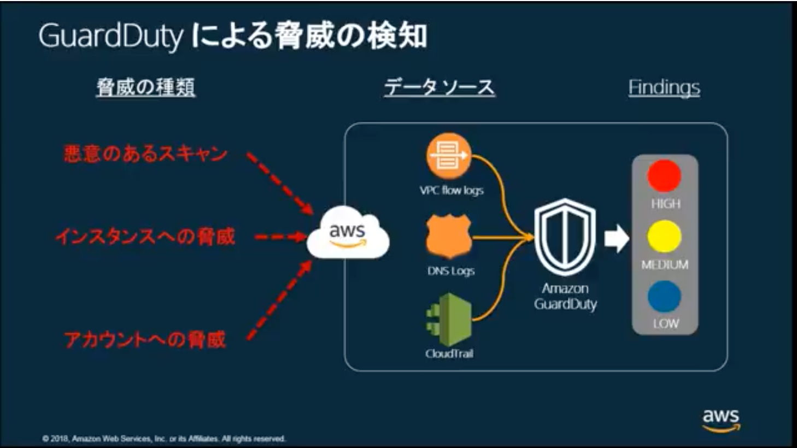

# 20190521 AWS Black Belt Online Seminar Amazon Simple Email Service

[YouTube](https://www.youtube.com/watch?v=Tb2Uw4B_Ihw)  
[スライド](https://www.slideshare.net/AmazonWebServicesJapan/20180509-aws-black-belt-online-seminar-amazon-guardduty)  
[FAQ](https://aws.amazon.com/jp/blogs/news/webinar-bb-guardduty-2018/)

## ざっくりどんなサービスなのか

- セキュリティの観点から驚異リスクを検知するAWSマネージド・サービス
- エージェント、センサー、ネットワークアプライアンス等は不要
- 30日間お試しで使える

### どんな風に脅威の検知をするのか

簡単に導入できる、ワンクリック

## 検知の仕組み

- Threat Detection Types
  - Signature検知
    - 既に脅威と知っているものとマッチング、マッチすれば閉じる
  - Behavioral検知
    - 普段と違う様子を見つけたら検知する

- 何のデータを元に検出するのか
  - VPC Flow Logs
    - 有効にしてなくてもGuardDuty Dindingsを生成
  - DNS Logs
  - CloudTrail Events

- Trusted & Threat IP Lists
  - 脅威インテリジェンス
    - 攻撃者が使用することが分かっているIPアドレスとドメインで構成
      - CrowdStrike
      - Proofpoint
      - AWS Security
    - ここはAWSがマネージドしている所なので追加・変更は出来ない
  - カスタムリストを作成可能
    - ホワイトリスト
    - ブラックリスト

- Findings
  - 確認画面
    - マネジメントコンソール
      - 重要度
      - 頻度
      - リージョン
      - 国
      - 脅威タイプ
      - 影響範囲
      - 攻撃元情報
    - APIでも確認可能
  - 攻撃リスクの主な目的
    - バックドア
    - マイニング
    - 色々追加されている
  - 検出時のアクション
    - CloudWatch Eventsにつないで、そこからLambdaを実行するような事ができる

- 料金
  - 2つのディメンジョンの合計金額が課金される
    - CloudTrail Events
    - VPC Flow Logs/DNS Logs
  - 最もこの合計を把握している人はおそらくいない -> 無料枠で確認

- アカウント
  - 前提知識：GuardDutyはリージョン毎に有効にするもの
  - マルチアカウント運用でGuardDutyの共用管理ができる
    - あるAWSアカウントで検知したFindingを他AWSアカウントのGuardDutyに転送・統合管理できる
  - 全アカウント・全リージョンで出入りして有効にする必要ある...？
    - CloudFormationテンプレートを使うと良い
    - **CloudFormationStackSets**を使えば、マルチアカウント・マルチリージョンで流せる
  - 集約するには管理者側、管理される側で操作が必要
    - 管理する側
      - CreateMembers
      - InviteMembers
    - 管理される側
      - CreateDetector
      - AcceptInvitation
    - `amazon-guardduty-multiaccount-scripts` 公開してる
    - 

