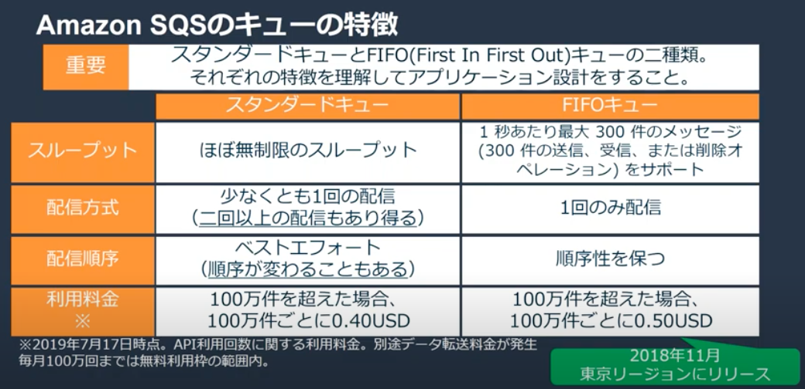
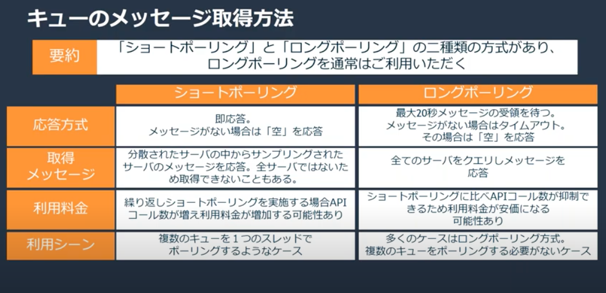
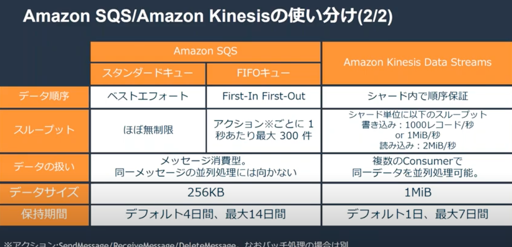

# 20190717 AWS Black Belt Online Seminar Amazon Simple Queue Service

[YouTube](https://www.youtube.com/watch?v=avfc0gQ7X0A)  
[スライド](https://www.slideshare.net/AmazonWebServicesJapan/20190717-aws-black-belt-online-seminar-amazon-simple-queue-service?ref=https://aws.amazon.com/)  
[FAQ](https://aws.amazon.com/jp/sqs/faqs/)

## アプリケーションの柔軟性を高める

柔軟性を高めるにはアプリケーションを分割して、機能の凝集度を高めた上で、結合を疎結合にする必要がある。  
コンポーネント間の結合を弱めるためのひとつの方法がキューなどの「つなぐ」コンポーネントを間に挟むこと。  

## 「つなぐ」コンポーネントを入れる際に検討すること

- 送信するデータはどのようなデータか？
- 呼び出した処理の完了を待つ必要があるか？
- 任意のタイミングで処理をしたいか？
- 処理の依頼先は一箇所？　複数？

### 送信するデータはどのようなデータか？

ストリーミング方式かメッセージング方式か、どちらを選ぶべきかを検討する。
前者はメッセージ間に順序性などの意味があり、後者はメッセージがそれぞれ独立している。

### 呼び出した処理の完了を待つ必要があるか？

同期方式か非同期方式か。  
同期方式は、リクエスタがプロバイダの処理完了までの応答を待つ。非同期は待たない。  

### 任意のタイミングで処理をしたいか？

Push方式かPull方式か。  
Pushはプロデューサの任意のタイミング、Pullはコンシューマーの任意のタイミングでメッセージを受ける。  
お互いが任意のタイミングで送受信したい場合はコネクタを間に挟み、お互いが好きなタイミングでコネクタに送る。  

### 処理の依頼先は一箇所？　複数？

P2P方式かPublish Subscriber方式か。
前者はプロデューサとコンシューマが1対1。後者はPublisher1に対しSubscriberが複数いる。

---

## 各ユースケース別に使えるAWSリソース

- ストリーミングデータを取り扱いたいのなら
  - Kinesis -> テキストから動画まで
  - Managed Streaming for Kafka -> Kafkaをマネージドで
  - API Gateway -> WebSocketをサポート
- メッセージデータを取り扱いたい場合
  - SNS -> 非同期・Push・Pub/Sub
  - SQS -> 非同期・Pull・P2P
  - MQ -> 非同期・Pull・P2PでもPub/Subでも対応

## Amazon SQSの特徴

- セキュリティ
  - アクセス制限やメッセージの暗号化
- 耐久性
  - 分散キュー
- 可用性
- スケーラビリティ
- フルマネージド
- 初期投資不要

## SQSの構成要素

- プロデューサ
  - キューにメッセージを送信するアプリケーション
  - メッセージ：プロデューサが生成するデータ、最大256KB
- コンシューマ
  - キューのメッセージをPullするアプリケーション
  - キュー：メッセージをキューイングする。分散キュー。メッセージを最大14日間保持可能。

### 利用ケース1.バッファリング

大量リクエストが一時的に発生する場合にキューで受け取り、コンシューマが任意のタイミングで処理する。

### 利用ケース2.ワークキュー

コンシューマとプロデューサの結合を弱める。  
サービスメンテナンス等の影響を受けにくい。

### 利用ケース3.リクエストのオフロード

重い処理が含まれていても素早く応答をしたい。  
プロデューサは軽い処理だけ実施し、重い処理はキューに投げてコンシューマで実施する、というような使い方ができる。

### 利用ケース4.ターゲットのファンアウト

複数の処理を並列処理をしたい時、AWS SNSと組み合わせる事で実現可能。  
プロデューサからの要求を1度SNSで受けて、複数のSQSがサブスクライバとしてpullし、その裏のコンシューマが受ける。  
SNSを挟まない場合、プロデューサ側で並列化の制御を実装する必要があるが、SNSを挟む事でマネージドサービスに任せることができる。  

---

## キューの種類

### スタンダードキュー

2回以上の配信が行われる場合がある。コンシューマ側では冪等性を保てる実装が必要。

### キューのメッセージ取得方法

通常はロングポーリングを利用。  
複数のSQSを配置して順番に確認する、というような場合はショートポーリングを利用する。  

SQSでメッセージを取得する際のお作法としては、以下を実装する必要がある。  

1. ポーリング
2. 取得＆処理
3. キューから情報を削除 <-忘れずに！

---

## SQSの機能詳細

### 可視性タイムアウト

コンシューマが取得したメッセージに対して指定された期間、他のコンシューマからの同一メッセージへのアクセスをブロックする機能。デフォルト30秒。  
複数のコンシューマが同じメッセージを処理するのを防ぐ。  
ただしスタンダードキューの場合は2回受信しない保証にはならない。  

### 遅延キューとメッセージタイマー

プロデューサーがメッセージをキューに送信してから一定時間経過後にコンシューマがメッセージを確認できるようになる機能。  
リトライ処理などを一定時間後に利用したい場合。  
遅延キューはキュー全体、メッセージタイマーはメッセージ個別に設定する。両方設定されていれば後者が優先。  
メッセージタイマーはFIFOキューは未サポート。

### Dead Letter Queue

正しく処理できないメッセージがキューに滞留し続けるのを回避するため、分離先として利用される。  
例えば最大4回まで受信する、と設定すると、5回めはDLQに移動する。  

### サーバーサイド暗号化

KMSで管理されているキーを利用してSQSキュー内のメッセージを暗号化する。  
プロデューサが保存時に暗号化する。プロデューサもコンシューマもKMSへのアクセス権限が必要。

### キューのアクセス制御

IAMないしAmazon SQSポリシーによってアクセス制御可能。  
前者は特定ユーザーやロールに対してアクセス制御、後者は特定のキューに対するアクセス制御を行う。

### メッセージ属性

メッセージ本文とは別にメタデータを保持させることができる。最大10個。  
暗号化の対象外になるので注意。  

### キューのモニタリング

CloudWatchを利用することで把握可能。コンシューマのスケールアウト/インにも利用可能。

### SQSとKinesisの使い分け

ストリーミングデータではKinesis、それ意外であればデータ特性に応じて使い分け。  

### 利用料金

APIリクエスト数に基づく料金 + データ転送料。  
